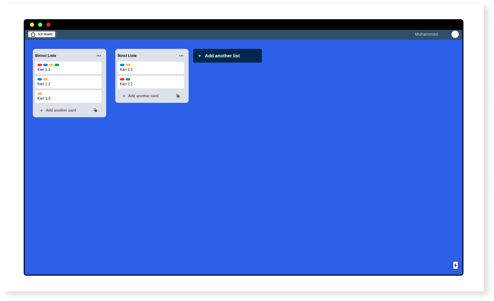
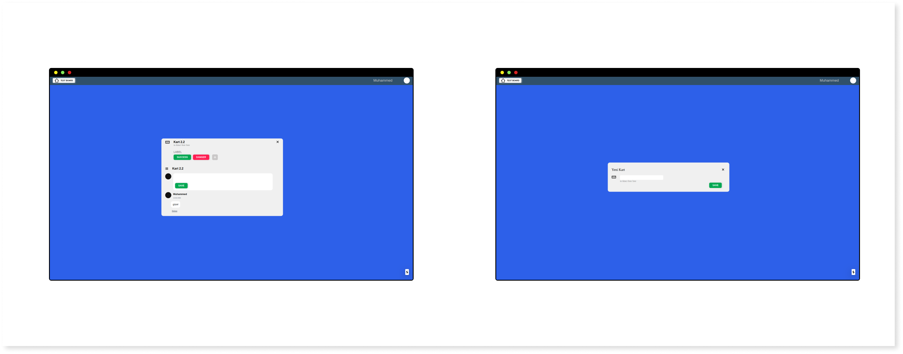

<h1 style='text-align:center'>React Trello Clone</h1>

<h4>Demo</h4>
<a>https://react-trello-clone.vercel.app</a>

<br>
<br>
<h4>TODOS</h4>

- [ ] Yeni liste ekleme
- [x] Yorum zamanı
- [ ] Yorum editleme
- [x] Yeni kart ekleme cartı düzenle
- [ ] Resim ekleme

<br><br>

<h4>Views</h4>
<br>




<br><br>

<h4>Development</h4>

```
yarn install

yarn dev
```

<br><br>

<h3>License</h3>
<p>This code is released under the MIT License</p>
